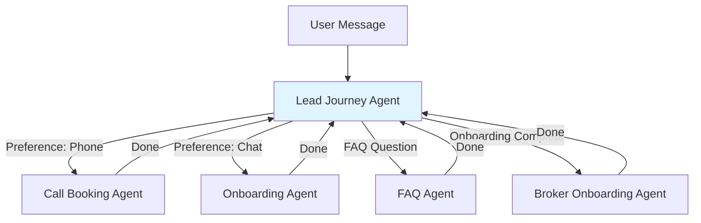

# Lucentive Club Agent System Adaptation Analysis

## Current Repository Architecture

### Core Components

- **Framework**: OpenAI Agents SDK with ChatKit frontend
- **Architecture Pattern**: Triage-based routing with specialist agents
- **Entry Point**: Triage Agent routes to specialists
- **Handoff Mechanism**: Bidirectional agent-to-agent handoffs with callback hooks
- **Context Management**: Stateful context (AirlineAgentContext) persists conversation data
- **Guardrails**: Input guardrails (relevance, jailbreak) prevent off-topic conversations
- **Tools**: Function-based tools that agents can call
- **Server**: FastAPI backend with ChatKit integration

### Current Agent Structure

1. **Triage Agent** - Entry point, routes to specialists
2. **FAQ Agent** - Answers policy questions using `faq_lookup_tool`
3. **Flight Information Agent** - Provides flight status
4. **Booking & Cancellation Agent** - Handles bookings
5. **Seat & Special Services Agent** - Manages seat changes
6. **Refunds & Compensation Agent** - Handles compensation cases

### Handoff Pattern

- Agents can hand off to other agents via `handoff()` function
- Handoffs can have `on_handoff` callbacks to prepare context
- Most agents return to Triage Agent when done
- **Issue**: No centralized orchestrator - agents decide their own next steps

---

## Mapping Current Agents to Lucentive Requirements

### ✅ Direct Mappings (Easy Adaptations)

#### 1. FAQ Agent → Lucentive FAQ Agent

**Current**: Uses `faq_lookup_tool` to answer policy questions

**Adaptation**:

- Replace `faq_lookup_tool` implementation to read from your Q&A document
- Update system prompt for Lucentive Club context
- Keep same agent structure - **100% reusable**

#### 2. Triage Agent → Lead Journey Orchestrator (Modified)

**Current**: Routes to specialists based on intent

**Adaptation**:

- Transform into proactive "Lead Journey Agent" that drives the conversation
- Add preference detection (chat vs. phone)
- Manage onboarding flow state
- Route to specialists but **always return control** after specialist completes task

### 🔄 Replace with New Agents (Instead of Adapting)

**Decision**: For agents requiring significant changes, we'll create new agents from scratch rather than adapting existing ones. This simplifies the codebase and avoids carrying over unnecessary airline-specific logic.

#### 3. Call Booking Agent (NEW - replaces Seat & Special Services Agent)

**Why Replace**: Domain logic completely different (call scheduling vs seat changes)

**New Agent**:

- Availability checking (20 min, 2-4 hours, booking link)
- Sequential suggestion pattern (one option at a time)
- Always returns to Lead Journey Agent

#### 4. Broker Onboarding Agent (NEW - replaces Booking & Cancellation Agent)

**Why Replace**: Tools and logic completely different (broker registration vs flight booking)

**New Agent**:

- Country-based broker selection
- Bot/strategy recommendation based on preferences
- Registration/connection link sending
- Video/explainer sending from registry
- Always returns to Lead Journey Agent

#### 5. Onboarding Agent (NEW)

**Required**: Structured question flow (one at a time)

- Trading experience
- Markets of interest
- Risk appetite
- Existing broker account status
- Resume capability (check what's already answered)
- Always returns to Lead Journey Agent

### ⏸️ Deferred Features

#### Human Handoff Mechanism (DEFERRED)

**Status**: Will be implemented later after evaluating how the new agent structure handles user requests

**Rationale**: Focus first on getting the core agent orchestration working, then add human handoff if needed

---

## Gap Analysis

### ✅ What Works Well

1. **Agent Framework**: OpenAI Agents SDK is solid foundation
2. **Context Management**: Stateful context pattern perfect for lead journey tracking
3. **Tool System**: Function-based tools easy to adapt
4. **Guardrails**: Can be adapted for compliance - **CRITICAL**: Must prevent guarantees, password requests, and other compliance violations
5. **Handoff Infrastructure**: The mechanism exists, just needs orchestration changes
6. **ChatKit Frontend**: Modern chat UI ready to use

### ❌ Critical Gaps

#### 1. Handoff Orchestration Problem

**Current**: Agents hand off to each other and can stay with specialists

**Required**: Always return to main "Lead Journey Agent" after specialist completes task

**Solution Options**:

- **Option A**: Modify all specialist agents to always hand off back to Lead Journey Agent
- **Option B**: Add orchestration layer that intercepts handoffs and routes back to main agent
- **Option C**: Make Lead Journey Agent the only one that can route to specialists (specialists can't route to each other)

**Recommendation**: Option C - Make Lead Journey Agent the central hub

**Team Feedback**: Confirmed - Lead Journey Agent as the only router. Specialists should return results and let Lead Journey Agent decide next steps. No chain-routing between specialists.

#### 2. Proactive vs Reactive

**Current**: System is reactive (responds to user messages)

**Required**: Proactive lead journey (ask next question, suggest next step)

**Solution**: Lead Journey Agent needs to:

- Track onboarding progress in context
- Ask next question automatically
- Drive conversation forward

#### 3. Structured Onboarding Flow

**Current**: No structured multi-step flow with state tracking

**Required**: One question at a time, resume if interrupted

**Solution**:

- Add `onboarding_state` to context (e.g., `{"step": "trading_experience", "completed": ["preference"]}`)
- Onboarding Agent checks state and asks next unanswered question
- Lead Journey Agent routes to Onboarding Agent when needed

#### 4. Human Handoff (DEFERRED)

**Status**: Deferred until after initial implementation

**Rationale**: Evaluate how well the new agent structure handles user requests before adding human handoff complexity

#### 5. Phone Call Booking Logic

**Current**: No call scheduling capability

**Required**: Availability checking, sequential suggestions

**Solution**: New Call Booking Agent with simplified tool:

- `compute_call_next_step()` - Single tool that returns `{stage, message_hint, slots?, link?}`
  - Handles all logic internally (20 min check, 2-4 hour check, booking link fallback)
  - Returns one suggestion at a time based on current stage
  - Simpler and harder to break than multiple tools

#### 6. Knowledge Base Integration

**Current**: Hardcoded FAQ responses

**Required**: External Q&A document, broker registry, country mapping

**Solution**:

- Replace `faq_lookup_tool` to read from your Q&A document (JSON/YAML/CSV)
- Create `broker_registry_tool` to look up broker links/videos by country
- Create `country_availability_tool` to check broker/bot availability

---

## Handoff Mechanism Evaluation

### Current Handoff Pattern

```
User Message → Triage Agent → Specialist Agent → (may stay or return to Triage)
```

**Issues for Lucentive**:

1. Specialists can hand off to each other (not desired)
2. No guarantee of returning to main orchestrator
3. No proactive journey management

### Proposed Handoff Pattern for Lucentive

```
User Message → Lead Journey Agent → Specialist Agent → Lead Journey Agent (always)
```

**Implementation**:

1. **Lead Journey Agent** is the only agent that can route to specialists
2. **Specialist Agents** can only hand off back to Lead Journey Agent
3. **Lead Journey Agent** tracks journey state and proactively asks next question
4. **Lead Journey Agent** decides when to route to specialists based on:

   - User preference (chat vs phone)
   - Onboarding completion status
   - User questions (FAQ)
   - Broker onboarding needs

**Code Changes Needed**:

- Modify specialist agent handoffs to only include Lead Journey Agent
- Update Lead Journey Agent to have all specialist agents in its handoff list
- Add journey state tracking in context
- Add proactive question logic in Lead Journey Agent instructions

---

## Recommendation: Adapt vs Build from Scratch

### ✅ **RECOMMENDATION: ADAPT THIS REPO**

### Why Adapt (Pros)

1. **Solid Foundation**: OpenAI Agents SDK + ChatKit is production-ready
2. **Time Savings**: 60-70% of infrastructure already built
3. **Proven Patterns**: Agent handoffs, context management, tools all work
4. **Frontend Ready**: ChatKit UI is modern and functional
5. **Extensible**: Easy to add new agents, tools, guardrails

### Adaptation Effort Estimate

- **Easy (1-2 days)**: FAQ Agent adaptation, context model updates
- **Medium (3-5 days)**: Lead Journey Agent creation, handoff orchestration
- **Medium (3-5 days)**: New specialist agents (Onboarding, Call Booking, Broker Onboarding)
- **Medium (2-3 days)**: Knowledge base integration (Q&A, broker registry, country mapping)
- **Total**: ~1.5-2 weeks for core adaptation (without human handoff)

### Why Not Build from Scratch (Cons of that approach)

- Would need to rebuild: agent framework, handoff mechanism, context management, tool system, frontend
- Estimated time: 4-6 weeks minimum
- Higher risk of bugs and missing features

---

## Incremental Adaptation Plan

This plan proceeds step-by-step with checkpoints where we'll gather required information from you before proceeding.

---

### Phase 0: Information Gathering & Setup

**Status**: ⏸️ **CHECKPOINT - Need Your Input**

Before starting implementation, we need:

1. **Agent Instructions/Prompts**

   - Lead Journey Agent system prompt and behavior guidelines
   - FAQ Agent prompt (adapted for Lucentive)
   - Onboarding Agent prompt and question flow
   - Call Booking Agent prompt
   - Broker Onboarding Agent prompt

2. **Actual User Flows**

   - Preferred chat flow (step-by-step)
   - Phone call booking flow (step-by-step)
   - Onboarding question sequence and logic
   - Broker selection and onboarding flow

3. **Knowledge Base Files**

   - Q&A document (format: JSON/YAML/CSV? structure?)
   - Broker registry (format? structure? fields needed?)
   - Country → broker/bot availability mapping (format?)

4. **Compliance Rules & Redlines**

   - List of prohibited phrases (guarantees, returns promises, etc.)
   - Password/credential handling rules
   - What should trigger escalation to human?
   - Any other compliance requirements

5. **Call Scheduling Logic**

   - Business hours/availability windows
   - How to check if call available in 20 min?
   - How to check if call available in 2-4 hours?
   - Booking link format/URL structure

**Action**: Please provide these materials, and we'll proceed to Phase 1.

---

### Phase 1: Foundation & Context Model

**Prerequisites**: Phase 0 complete

1. **Update Context Model** (`python-backend/airline/context.py` → `python-backend/lucentive/context.py`)

   - Remove airline-specific fields
   - Add Lucentive fields:
     - `preference: str | None` (chat/phone)
     - `onboarding_state: dict` (track progress: `{"completed": ["preference", "trading_experience"], "current_step": "markets_interest"}`)
     - `lead_country: str | None`
     - `selected_broker: str | None`
     - `selected_bot: str | None`
     - `call_booking_stage: str | None` (for tracking call booking progress)

2. **Create Directory Structure**

   - `python-backend/lucentive/` - New module
   - `python-backend/lucentive/knowledge/` - For knowledge base files
   - Move/adapt context model

**Deliverable**: Updated context model ready for agents

---

### Phase 2: Compliance Guardrails

**Prerequisites**: Phase 1 complete, compliance rules from Phase 0

1. **Create Compliance Guardrails** (`python-backend/lucentive/guardrails.py`)

   - **No Guarantees Guardrail**: Detect and block promises of returns/performance
   - **No Credentials Guardrail**: Detect and block requests for passwords/MT5 credentials
   - **Compliance Redlines**: Block other prohibited phrases/behaviors
   - Escalation logic when guardrails trip

2. **Update Guardrail System**

   - Adapt existing guardrail framework
   - Add compliance-specific guardrails to all agents

**Deliverable**: Compliance guardrails protecting all conversations

**Status**: ⏸️ **CHECKPOINT** - Review guardrail behavior with you

---

### Phase 3: Lead Journey Agent (Central Orchestrator)

**Prerequisites**: Phase 1-2 complete, agent instructions from Phase 0

1. **Create Lead Journey Agent** (`python-backend/lucentive/agents.py`)

   - Replace Triage Agent with proactive Lead Journey Agent
   - Implement preference detection (chat/phone)
   - Journey state tracking and proactive question logic
   - **Strict rule**: Only agent that can route to specialists
   - Handoff list: [FAQ Agent, Onboarding Agent, Call Booking Agent, Broker Onboarding Agent]

2. **Update Server** (`python-backend/server.py`)

   - Update imports to use Lead Journey Agent as entry point
   - Ensure Lead Journey Agent is the default/starting agent

**Deliverable**: Central orchestrator agent ready

**Status**: ⏸️ **CHECKPOINT** - Test preference detection and routing logic

---

### Phase 4: FAQ Agent Adaptation

**Prerequisites**: Phase 3 complete, Q&A document from Phase 0

1. **Adapt FAQ Agent** (`python-backend/lucentive/agents.py`)

   - Update system prompt (from Phase 0 instructions)
   - Ensure it always returns to Lead Journey Agent
   - Add compliance guardrails

2. **Create FAQ Tool** (`python-backend/lucentive/tools.py`)

   - Replace `faq_lookup_tool` to read from Q&A document
   - Implement document loader (format depends on Phase 0)
   - Return answers from knowledge base

**Deliverable**: FAQ Agent working with your Q&A document

**Status**: ⏸️ **CHECKPOINT** - Test FAQ lookups and verify answers

---

### Phase 5: Onboarding Agent

**Prerequisites**: Phase 3-4 complete, onboarding flow from Phase 0

1. **Create Onboarding Agent** (`python-backend/lucentive/agents.py`)

   - System prompt from Phase 0
   - Structured question flow (one at a time)
   - Resume capability (check `onboarding_state` in context)
   - Update context with answers
   - **Strict rule**: Only hand off back to Lead Journey Agent

2. **Onboarding State Management**

   - Track completed questions in context
   - Ask next unanswered question automatically
   - Handle interruptions gracefully

**Deliverable**: Onboarding Agent asking questions one at a time

**Status**: ⏸️ **CHECKPOINT** - Test onboarding flow and resume capability

---

### Phase 6: Call Booking Agent

**Prerequisites**: Phase 3-5 complete, call scheduling logic from Phase 0

1. **Create Call Booking Agent** (`python-backend/lucentive/agents.py`)

   - System prompt from Phase 0
   - Sequential suggestion pattern (one option at a time)
   - **Strict rule**: Only hand off back to Lead Journey Agent

2. **Create Call Booking Tool** (`python-backend/lucentive/tools.py`)

   - **Simplified approach**: Single tool `compute_call_next_step()`
   - Returns: `{stage: str, message_hint: str, slots?: list, link?: str}`
   - Internal logic handles: 20 min check → 2-4 hour check → booking link
   - Tracks stage in context to suggest next option if declined

**Deliverable**: Call Booking Agent with simplified tool

**Status**: ⏸️ **CHECKPOINT** - Test call booking flow and sequential suggestions

---

### Phase 7: Broker Onboarding Agent

**Prerequisites**: Phase 3-6 complete, broker registry and country mapping from Phase 0

1. **Create Broker Onboarding Agent** (`python-backend/lucentive/agents.py`)

   - System prompt from Phase 0
   - Country-based broker selection
   - Bot/strategy recommendation based on preferences
   - **Strict rule**: Only hand off back to Lead Journey Agent

2. **Create Broker Tools** (`python-backend/lucentive/tools.py`)

   - `broker_registry_tool` - Look up broker links/videos by country
   - `country_availability_tool` - Check broker/bot availability by country
   - `send_registration_link()` - Send registration link from registry
   - `send_copy_trade_link()` - Send copy-trade link from registry
   - `send_explainer_video()` - Send video from registry

3. **Load Knowledge Bases**

   - Broker registry loader
   - Country availability mapper
   - Integration with tools

**Deliverable**: Broker Onboarding Agent with full knowledge base integration

**Status**: ⏸️ **CHECKPOINT** - Test broker selection and link sending

---

### Phase 8: Integration & Testing

**Prerequisites**: All phases complete

1. **End-to-End Testing**

   - Test complete user journeys
   - Verify handoff orchestration (Lead Journey always in control)
   - Test compliance guardrails
   - Test all specialist agents return to Lead Journey

2. **Refinement**

   - Tune prompts based on testing
   - Adjust guardrail sensitivity
   - Fix any flow issues

3. **Documentation**

   - Document agent responsibilities
   - Document handoff rules
   - Document knowledge base formats

**Deliverable**: Fully functional Lucentive Club agent system

---

## Key Implementation Rules (From Team Feedback)

1. **Orchestration**: Lead Journey Agent is the ONLY router. Specialists return results and hand off back to Lead Journey. No chain-routing.

2. **Call Booking**: Use single tool `compute_call_next_step()` instead of multiple tools. Simpler and harder to break.

3. **Compliance**: Strict guardrails must prevent:

   - Guarantees or promises of returns/performance
   - Requests for passwords or MT5 credentials
   - Other compliance violations (from your redlines)

4. **Knowledge Boundaries**: All links, videos, and information must come from predefined registries, not generated ad hoc.

---

## Key Files to Modify/Create

### Modify Existing

- `python-backend/airline/agents.py` - Keep FAQ Agent, replace others with new Lucentive agents
- `python-backend/airline/context.py` - Update context model (remove airline fields, add Lucentive fields)
- `python-backend/airline/tools.py` - Keep and adapt `faq_lookup_tool`, remove airline-specific tools
- `python-backend/server.py` - Update agent imports (no human handoff changes needed yet)
- `python-backend/main.py` - Update agent imports

### Create New

- `python-backend/lucentive/context.py` - Updated context model for Lucentive
- `python-backend/lucentive/agents.py` - New agent definitions (Lead Journey, Onboarding, Call Booking, Broker Onboarding, FAQ)
- `python-backend/lucentive/tools.py` - New tools (call booking, broker lookup, country availability, FAQ lookup)
- `python-backend/lucentive/guardrails.py` - Compliance guardrails (no guarantees, no credentials, etc.)
- `python-backend/lucentive/knowledge/` - Q&A, broker registry, country mapping files (provided by you)
- **Note**: Human handoff utilities deferred

---

## Architecture Diagram



---

## Conclusion

**Verdict: ADAPT THIS REPO** ✅

The repository provides a solid foundation that can be adapted to meet Lucentive Club's requirements. The incremental plan above proceeds step-by-step with checkpoints to gather required information.

**Key Implementation Principles (From Team Feedback)**:

1. **Lead Journey Agent as Central Hub**: Only router, specialists return results and hand off back
2. **Simplified Call Booking**: Single tool `compute_call_next_step()` instead of multiple tools
3. **Strict Compliance**: Guardrails prevent guarantees, password requests, and other violations
4. **Knowledge Boundaries**: All information from predefined registries, not generated

**Next Steps**:

1. **Phase 0**: Provide agent instructions, flows, knowledge base files, compliance rules, and call scheduling logic
2. **Phase 1-8**: Incremental implementation with checkpoints for testing and feedback

The estimated effort (1.5-2 weeks) is significantly less than building from scratch (4-6 weeks), and you'll benefit from a proven, production-ready framework.
